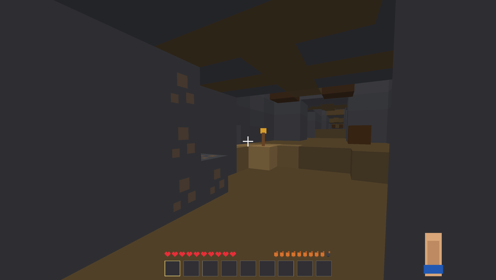
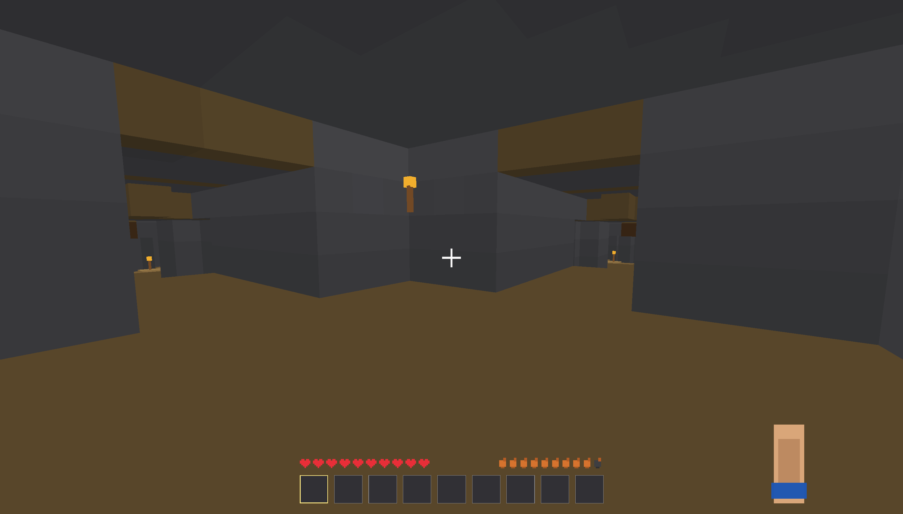
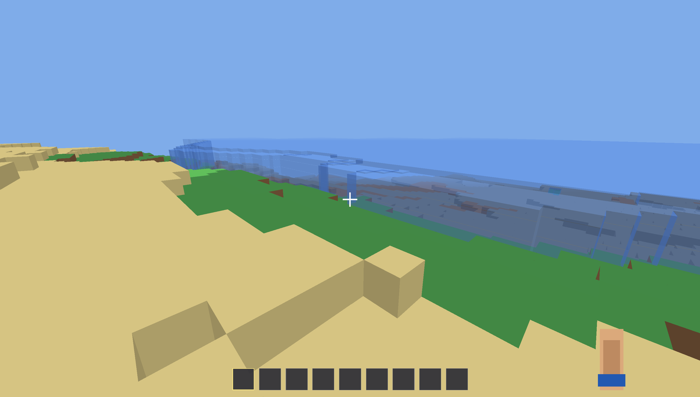
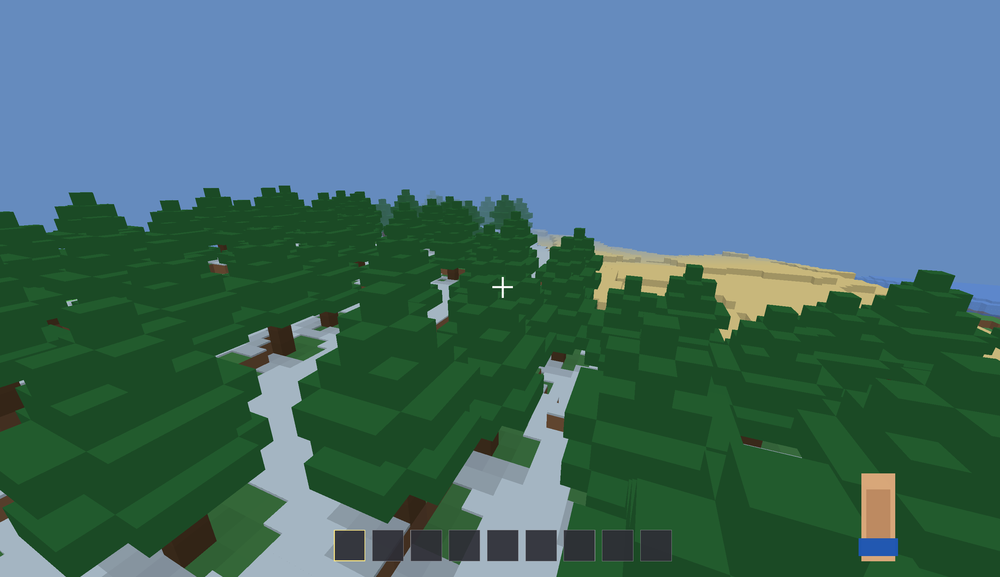
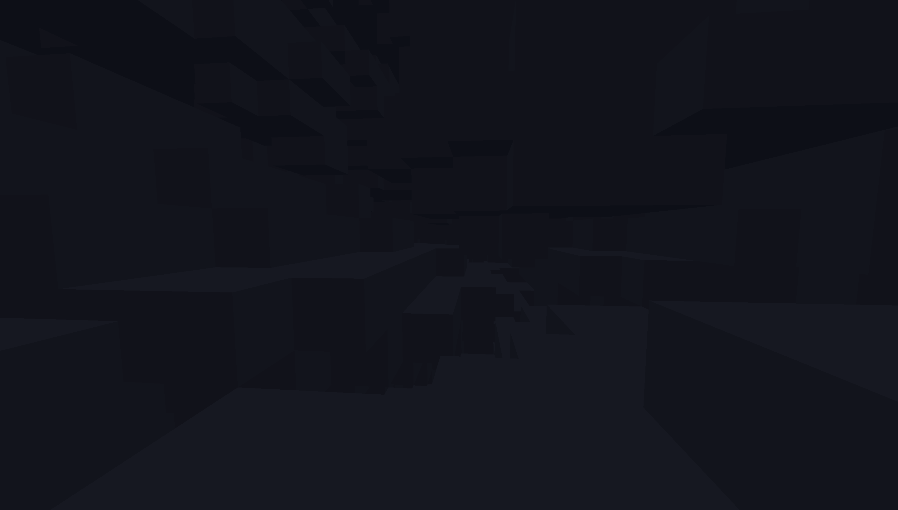

# Tiny Minecraft OpenGL

Tiny Minecraft OpenGL - маленькая Java/LWJGL voxel-песочница в стиле Minecraft. В игре есть блочный мир, биомы, пещеры, шахты, деревни, мобы, инвентарь, крафт, сундуки, печки и команды для исследования мира.

## Скриншоты


| Шахта | Пещеры |
| --- | --- |
|  |  |

| Побережье | Лес | Глубокая пещера |
| --- | --- | --- |
|  |  |  |

## Быстрый старт

1. Откройте [страницу релизов](https://github.com/vakisnn-gd/TinyMinecraft/releases).
2. Скачайте `TinyMinecraft-v0.1-windows.zip`.
3. Распакуйте архив.
4. Запустите `run-game.bat`.

Нужна Java 17 или новее.

## Документация

- [FAQ](FAQ.md) - частые вопросы по скачиванию и запуску.
- [CHANGELOG](CHANGELOG.md) - история версий.
- [KNOWN_ISSUES](KNOWN_ISSUES.md) - известные проблемы.
- [ROADMAP](ROADMAP.md) - план разработки.
- [Wiki](https://github.com/vakisnn-gd/TinyMinecraft/wiki) - русская wiki-страница проекта.
- [LICENSE](LICENSE) - MIT License.

## Возможности

- Чанковый voxel-мир
- Рельеф, пещеры, руды, реки, океаны и биомы
- Деревни, фермы, дома, шахты и шаблоны структур
- Базовое освещение и прозрачные блоки
- Двери, факелы, рельсы, грядки, культуры, кровати
- Инвентарь, творческий режим и режим выживания
- Верстак, сундук и печка
- Переплавка, еда, здоровье и голод
- Мобы, яйца спавна, дроп и простой бой
- Debug overlay и внутриигровые команды

## Управление

- `WASD` - движение
- `Space` - прыжок
- `Shift` - присесть
- `Ctrl` - бег
- Левая кнопка мыши - атака / ломание блока
- Правая кнопка мыши - взаимодействие / установка блока
- `E` - инвентарь
- `Esc` - меню паузы
- `F1` - скрыть/показать интерфейс
- `F3` - debug overlay
- `F4` - переключение режима
- `F5` - вид от третьего лица
- `1`-`9` - выбор слота хотбара

## Команды

Команды вводятся в игровом чате.

| Команда | Что делает |
| --- | --- |
| `/tp <x> <y> <z>` | Телепортирует игрока по координатам. |
| `/time set day` | Устанавливает день. |
| `/time set night` | Устанавливает ночь. |
| `/gamemode creative` | Включает творческий режим. |
| `/gamemode survival` | Включает режим выживания. |
| `/gamemode spectator` | Включает режим наблюдателя. |
| `/clear` | Очищает инвентарь. |
| `/say <сообщение>` | Выводит сообщение от сервера. |
| `/give <id> <количество>` | Выдаёт предмет или блок по ID. |
| `/spawnzombie` | Спавнит зомби рядом с игроком. |
| `/seed` | Показывает seed мира. |
| `/locate village` | Ищет ближайшую деревню. |
| `/locate mineshaft` | Ищет ближайшую шахту. |
| `/locate structure <village|mineshaft>` | Ищет структуру. |
| `/locate biome <название>` | Ищет биом. |
| `/place structure list` | Показывает список доступных структур. |
| `/place structure <name> [rotation]` | Ставит структуру рядом с игроком. |
| `/whereami` | Показывает текущую debug-позицию. |
| `/probe <x> <z>` | Показывает terrain/debug-информацию по координатам. |
| `/terrain <x> <z>` | То же, что `/probe`. |
| `/heighttest` | Запускает debug-проверку высот. |
| `/blockinfo` | Показывает информацию о блоке под прицелом. |

## Требования

- Java JDK 17 или новее
- LWJGL `.jar` файлы в папке `lib/`
- Windows - основная проверенная платформа

## Сборка

```powershell
javac -cp "lib/*" -d out *.java
```

## Запуск из исходников

```powershell
.\run-game.bat
```

Или вручную:

```powershell
java -cp "out;lib/*" TinyMinecraft
```

## Релизы

Готовые сборки лежат на странице релизов:

[https://github.com/vakisnn-gd/TinyMinecraft/releases](https://github.com/vakisnn-gd/TinyMinecraft/releases)

Для обычной игры скачивайте `TinyMinecraft-v0.1-windows.zip`.

Старые версии `v0.0.0` - `v0.0.8` оставлены как архив истории разработки и помечены как pre-release.

## Лицензия

Проект распространяется по лицензии MIT. Можно использовать, изменять, копировать и распространять код при сохранении текста лицензии.
