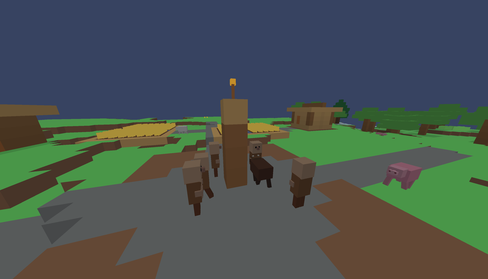

# Tiny Minecraft OpenGL

Tiny Minecraft OpenGL - маленький Java/LWJGL прототип в стиле Minecraft. Это не полноценный клон Minecraft, а экспериментальная voxel-песочница для изучения генерации чанков, OpenGL-рендеринга, выживания, инвентаря, крафта, контейнеров, пещер, деревень, мобов и сохранения мира.



## Быстрый старт

1. Откройте [страницу релизов](https://github.com/vakisnn-gd/TinyMinecraft/releases).
2. Скачайте `TinyMinecraft-v0.1-windows.zip`.
3. Распакуйте архив.
4. Запустите `run-game.bat`.

Нужна Java 17 или новее.

## Документация

- [FAQ](FAQ.md) - частые вопросы по скачиванию и запуску.
- [CHANGELOG](CHANGELOG.md) - история версий.
- [KNOWN_ISSUES](KNOWN_ISSUES.md) - известные проблемы.
- [ROADMAP](ROADMAP.md) - план разработки.
- [Wiki](https://github.com/vakisnn-gd/TinyMinecraft/wiki) - русская wiki-страница проекта.

## Текущее состояние

Это прототип `v0.1`. Игра умеет генерировать и отображать блочный мир, сохранять/загружать регионы, ставить и ломать блоки, использовать хотбар и инвентарь, крафтить предметы, открывать сундуки/печки/верстаки, спавнить мобов и исследовать сгенерированные деревни, пещеры и шахты.

В игру уже можно играть как в техническую демоверсию, но многие системы пока сырые или неполные. Подробнее см. [KNOWN_ISSUES.md](KNOWN_ISSUES.md) и [ROADMAP.md](ROADMAP.md).

## Требования

- Java JDK 17 или новее
- LWJGL `.jar` файлы в папке `lib/`
- Сейчас проверяется в основном Windows

## Сборка

```powershell
javac -cp "lib/*" -d out *.java
```

## Запуск

Для игроков удобнее использовать:

```powershell
.\run-game.bat
```

Для разработки можно использовать старый батник:

```powershell
.\run-opengl.bat
```

Или запустить вручную, если LWJGL native `.jar` файлы есть в `lib/`:

```powershell
java -cp "out;lib/*" TinyMinecraft
```

## Управление

- `WASD` - движение
- `Space` - прыжок
- `Shift` - присесть
- `Ctrl` - бег
- Левая кнопка мыши - атака / ломание блока
- Правая кнопка мыши - взаимодействие / установка блока
- `E` - инвентарь
- `Esc` - меню паузы
- `/locate structure village`
- `/locate structure mineshaft`
- `/place structure list`

## Что уже реализовано

- Чанковый voxel-мир
- Рельеф, пещеры, руды, реки/океаны и базовые биомы
- Деревни, фермы, дома, шахты и простые шаблоны структур
- Базовое освещение и прозрачные блоки
- Двери, факелы, рельсы, грядки, культуры, кровати
- Инвентарь, творческий инвентарь, инвентарь выживания
- Верстак, сундук, печка
- Переплавка в печке и еда
- Мобы, яйца спавна, дроп, простой бой
- Голод и здоровье
- Сохранение регионов/мира
- Debug overlay и команды поиска структур

## Релизы

Готовые сборки лежат на странице релизов:

[https://github.com/vakisnn-gd/TinyMinecraft/releases](https://github.com/vakisnn-gd/TinyMinecraft/releases)

Для обычной игры скачивайте `TinyMinecraft-v0.1-windows.zip`.

Старые версии `v0.0.0` - `v0.0.8` оставлены как архив истории разработки и помечены как pre-release.

## Сохранения

Миры сохраняются локально в папке `saves/` рядом с игрой. Личные миры разработчика не входят в релизы и не хранятся в репозитории.

## Область проекта

Это учебный прототип, а не законченная игра. Цель `v0.1` - держать проект компилируемым, запускаемым и понятным, честно документируя шероховатости вместо того, чтобы притворяться, что все системы уже финальные.

## Лицензия

Лицензия пока не выбрана. Если вы хотите, чтобы другие люди могли свободно использовать или изменять код, перед широкой публикацией стоит добавить лицензию.
