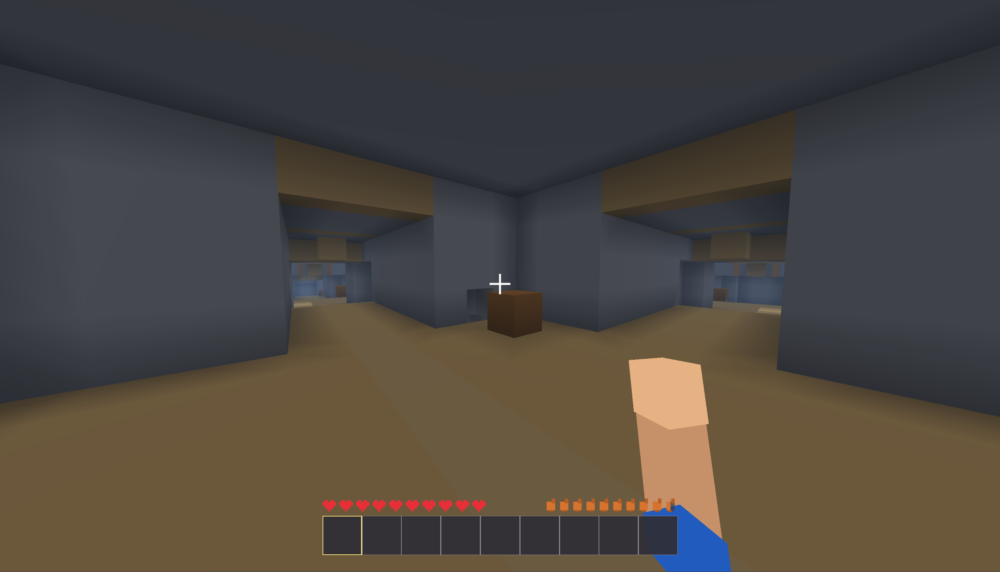

# TinyCraft

TinyCraft - небольшая Java/LWJGL voxel-песочница в стиле Minecraft. В игре есть чанковый мир, биомы, горы, пещеры, шахты, деревни, мобы, инвентарь, крафт, печки, сундуки, жидкости, команды, LAN-мультиплеер и первый dedicated server.

Текущая версия документации: `v0.2 Snapshot 8`.

## Скриншоты




## Быстрый старт

Требуется Java 8 или новее. Проект собирается с `--release 8`, поэтому совместим с Java 8 runtime, но запускать его можно и на более свежем JDK.

```powershell
javac -encoding UTF-8 --release 8 -cp "lib/*" -d out *.java
java -cp "out;lib/*" TinyCraft
```

На Windows можно использовать готовый запускатель:

```powershell
.\run-game.bat
```

## Dedicated Server

Snapshot 8 добавляет первый headless dedicated server. Он запускает авторитетный `VoxelWorld`, слушает TCP на `0.0.0.0:25566`, принимает обычных клиентов TinyCraft и не создает окно, renderer, GLFW или аудио.

Запуск из исходников:

```powershell
javac -encoding UTF-8 --release 8 -cp "lib/*" -d out *.java
java -cp "out;lib/*" TinyCraftServer --world server_world --port 25566
```

На Windows:

```powershell
.\run-server.bat
```

При первом запуске рядом с проектом создается локальный `server.properties`. CLI-аргументы перекрывают значения из файла. Мир сервера хранится в `saves/<world>` и переиспользуется при следующих запусках с тем же `world`.

Основные настройки:

```properties
port=25566
world=server_world
seed=
terrain=default
maxPlayers=8
motd=TinyCraft Snapshot 8 Server
allowPvp=true
allowCheats=false
viewDistance=8
```

Команды консоли сервера:

| Команда | Что делает |
| --- | --- |
| `help` | Показывает список команд. |
| `status` | Показывает uptime и число игроков. |
| `list` | Показывает подключенных игроков. |
| `say <сообщение>` | Отправляет сообщение всем клиентам. |
| `kick <player> [reason]` | Отключает игрока. |
| `save` | Сохраняет мир и подключенных игроков. |
| `stop` | Сохраняет мир и останавливает сервер. |

## Возможности Snapshot 8

- Dedicated server MVP без OpenGL-окна.
- Direct IP/LAN-подключение к integrated host или dedicated server.
- Сервер авторитетен по чанкам, блокам, времени, мобам, дропу, чату, позициям игроков и PvP.
- Таблица игроков по Tab с ping, здоровьем и статусом.
- Multiplayer-команды `/list`, `/ping`, `/msg`, `/kick`.
- Синхронизация здоровья игрока, server-side атак мобов и PvP-урона.
- Выдача подобранных предметов клиенту через серверный `INVENTORY_ADD`.
- Более явные ошибки при несовместимом протоколе, duplicate UUID, заполненном сервере и timeout.
- Сохранение server world и network player state между запусками dedicated server.

## Возможности игры

- Чанковый voxel-мир с потоковой прогрузкой колонок.
- Биомы, горы, пляжи, океаны, реки, пещеры, руды и шахты.
- Деревни, дома, фермы, дороги, жители и простые структуры.
- Вода, лава, прозрачные блоки, туман и базовое освещение.
- Выживание, творческий режим, режим наблюдателя, здоровье и голод.
- Инвентарь, хотбар, крафт, печки, сундуки и верстак.
- Мобы, дроп, яйца спавна, бой и базовый PvP.
- Внутриигровой чат с русским вводом, команды и debug overlay.

## Подключение к серверу

1. Запустите `TinyCraftServer` или `run-server.bat`.
2. Запустите обычный клиент `TinyCraft`.
3. Откройте "Мультиплеер".
4. Введите IP сервера. На том же ПК используйте `127.0.0.1`.
5. Порт оставьте `25566`, если вы не меняли его.
6. Нажмите "Подключиться".

Для подключения через интернет нужно вручную открыть TCP-порт `25566` в firewall/port-forward или использовать VPN. Встроенного relay, NAT traversal и публичного списка серверов пока нет.

## Тест мультиплеера на одном ПК

Сначала соберите проект:

```powershell
javac -encoding UTF-8 --release 8 -cp "lib/*" -d out *.java
```

Окно 1, сервер:

```powershell
java -cp "out;lib/*" TinyCraftServer --world server_world --port 25566
```

Окно 2, клиент:

```powershell
java -cp "out;lib/*" TinyCraft
```

Проверка:

- Клиент видит мир сервера.
- Сообщения в чате доходят до сервера и клиентов.
- Русский текст в чате отображается корректно.
- Установка и ломание блоков синхронизируются.
- Tab показывает список игроков и ping.
- `/list`, `/ping`, `/msg` работают в multiplayer-чате.
- `save` и `stop` на сервере сохраняют мир.

Если две копии клиента используют один и тот же `profile.properties`, сервер отклонит вторую как `Duplicate player uuid`. Для теста двух клиентов на одном ПК используйте отдельную рабочую папку или отдельный `profile.properties`.

## Сетевой протокол

- Транспорт: чистый TCP без сторонних сетевых библиотек.
- Framing: `int length` + `byte packetId` + payload через `DataInputStream` и `DataOutputStream`.
- `MAGIC = TCMP`.
- `VERSION = 3` в Snapshot 8.
- Порт по умолчанию: `25566`.

| ID | Пакет | Назначение |
| --- | --- | --- |
| 1 | `HELLO` | Версия протокола, UUID и ник клиента. |
| 2 | `WELCOME` | Seed, terrain preset, позиция спавна и время мира. |
| 3 | `PLAYER_SPAWN` | Появление удаленного игрока. |
| 4 | `PLAYER_STATE` | Позиция, поворот, предмет в руке, флаги и здоровье. |
| 5 | `PLAYER_DESPAWN` | Удаление игрока. |
| 6 | `CHAT` | Сообщения чата. |
| 7 | `CHUNK_REQUEST` | Запрос колонки чанка. |
| 8 | `CHUNK_DATA` | Данные колонки мира. |
| 9 | `BLOCK_ACTION` | Запрос ломания или установки блока. |
| 10 | `BLOCK_UPDATE` | Авторитетное изменение блока. |
| 11 | `WORLD_TIME` | Синхронизация времени. |
| 12 | `MOB_SNAPSHOT` | Снимок состояния мобов. |
| 13 | `DROPPED_ITEM_SNAPSHOT` | Снимок выпавших предметов. |
| 14 | `DISCONNECT` | Отключение с причиной. |
| 15 | `PLAYER_ATTACK` | Запрос атаки игрока. |
| 16 | `PLAYER_HEALTH` | Авторитетное здоровье игрока. |
| 17 | `PING` | Ping request. |
| 18 | `PONG` | Ping response. |
| 19 | `PLAYER_LIST` | Список игроков для Tab overlay. |
| 20 | `COMMAND` | Multiplayer-команды клиента. |
| 21 | `INVENTORY_ADD` | Серверная выдача подобранного item. |
| 22 | `MOB_ATTACK` | Запрос атаки моба клиентом. |

## Управление

- `WASD` - движение
- `Space` - прыжок
- `Shift` - присесть
- `Ctrl` - бег
- Левая кнопка мыши - атака или ломание блока
- Правая кнопка мыши - взаимодействие или установка блока
- `T` - чат
- `Tab` - список игроков в multiplayer
- `E` - инвентарь
- `Esc` - меню паузы
- `F1` - скрыть или показать интерфейс
- `F3` - debug overlay
- `F4` - переключение режима игры
- `F5` - вид от третьего лица
- `1`-`9` - выбор слота хотбара

## Команды

Команды вводятся в игровом чате.

| Команда | Что делает |
| --- | --- |
| `/list` | Показывает игроков в multiplayer-сессии. |
| `/ping` | Показывает текущий ping. |
| `/msg <player> <message>` | Отправляет личное сообщение. |
| `/kick <player> [reason]` | Отключает игрока, если команду выполняет host. |
| `/tp <x> <y> <z>` | Телепортирует игрока. |
| `/time set day` | Устанавливает день. |
| `/time set night` | Устанавливает ночь. |
| `/gamemode creative` | Включает творческий режим. |
| `/gamemode survival` | Включает режим выживания. |
| `/gamemode spectator` | Включает режим наблюдателя. |
| `/clear` | Очищает инвентарь. |
| `/say <сообщение>` | Выводит сообщение от сервера. |
| `/give <id> <количество>` | Выдает предмет или блок по ID. |
| `/spawnzombie` | Спавнит зомби рядом с игроком. |
| `/seed` | Показывает seed мира. |
| `/locate village` | Ищет ближайшую деревню. |
| `/locate mineshaft` | Ищет ближайшую шахту. |
| `/locate biome <название>` | Ищет биом. |
| `/place structure list` | Показывает список структур. |
| `/place structure <name> [rotation]` | Ставит структуру рядом с игроком. |
| `/whereami` | Показывает debug-позицию. |
| `/probe <x> <z>` | Показывает terrain/debug-информацию. |
| `/terrain <x> <z>` | То же, что `/probe`. |
| `/heighttest` | Запускает debug-проверку высот. |
| `/blockinfo` | Показывает информацию о блоке под прицелом. |

## Структура проекта

- `TinyCraft.java` - основной игровой цикл, UI и интеграция подсистем.
- `TinyCraftServer.java` - headless entrypoint dedicated server.
- `GameServer.java` - серверный tick loop, console commands и сохранение server world.
- `VoxelWorld.java` - мир, чанки, блоки, мобы, сохранения и mirror-режим.
- `OpenGlRenderer.java` - OpenGL-рендер мира и интерфейса.
- `MultiplayerManager.java` - LAN/dedicated host, клиент, сетевой tick и обработка пакетов.
- `MultiplayerProtocol.java` - ID пакетов и framing TCP-протокола.
- `LocalProfile.java` - локальный UUID/ник игрока.
- `ChatSystem.java` - чат и команды.
- `GameData.java` - основные константы меню/настроек и игровые данные.

## Документация

- [CHANGELOG](CHANGELOG.md) - история версий.
- [KNOWN_ISSUES](KNOWN_ISSUES.md) - известные проблемы.
- [ROADMAP](ROADMAP.md) - план разработки.
- [FAQ](FAQ.md) - частые вопросы.
- [LICENSE](LICENSE) - MIT License.

## Лицензия

Проект распространяется по лицензии MIT.
