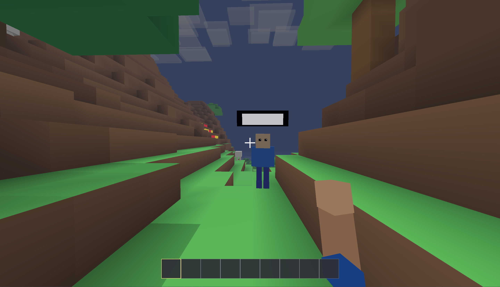
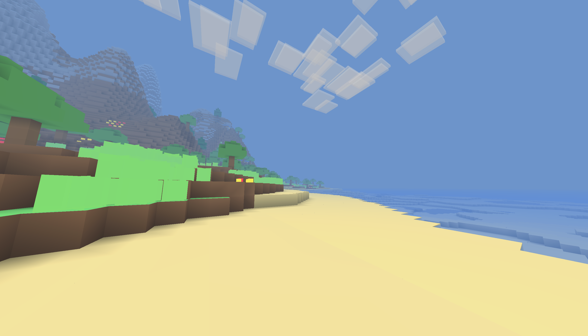
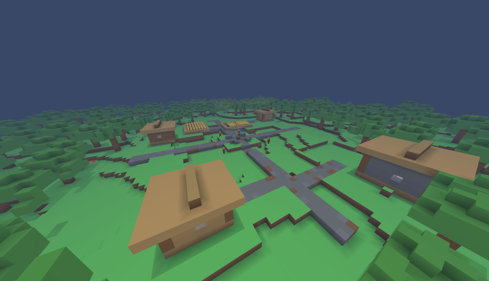
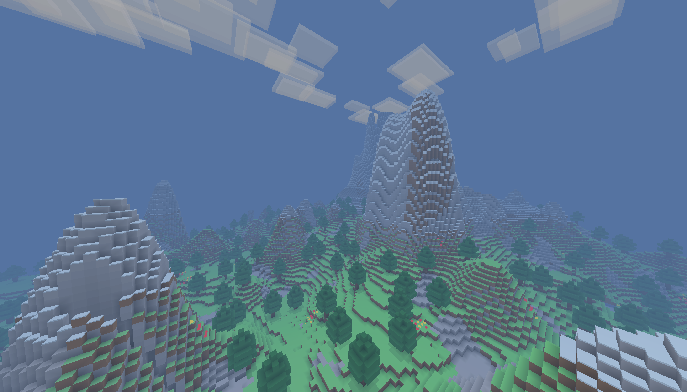

# TinyCraft

TinyCraft - небольшая Java/LWJGL voxel-песочница в стиле Minecraft. В игре уже есть чанковый мир, биомы, горы, пещеры, шахты, деревни, мобы, инвентарь, крафт, печки, сундуки, жидкости, команды и экспериментальный LAN-мультиплеер без внешних аккаунтов.

Текущая версия документации: `v0.2 Snapshot 7`.

## Скриншоты










## Быстрый Старт

Требуется Java 8 или новее. Проект сейчас собирается с `--release 8`, поэтому он совместим со старыми Java 8 runtime, но запускать его можно и на более свежем JDK. Предупреждения Java о том, что `source/target 8` устареют в будущем, не являются ошибкой сборки.

```powershell
javac -encoding UTF-8 --release 8 -cp "lib/*" -d out *.java
java -cp "out;lib/*" TinyCraft
```

Если вы запускаете готовую папку проекта на Windows, можно использовать:

```powershell
.\run-game.bat
```

## Возможности

- Чанковый voxel-мир с потоковой прогрузкой колонок.
- Биомы, горы, пляжи, океаны, реки, пещеры, руды и шахты.
- Деревни, дома, фермы, дороги, жители и простые структуры.
- Вода, лава, прозрачные блоки, туман и базовое освещение.
- Выживание, творческий режим, режим наблюдателя, здоровье и голод.
- Инвентарь, хотбар, крафт, печки, сундуки и верстак.
- Мобы, дроп, яйца спавна, бой и базовый PvP.
- Внутриигровой чат с русским вводом, команды и debug overlay.
- MVP LAN-мультиплеера через Direct IP.

## Snapshot 7: LAN-Мультиплеер

Snapshot 7 добавляет первый рабочий MVP мультиплеера для локальной сети и тестов на одном ПК. Это не публичная серверная инфраструктура, а прямое TCP-подключение между двумя копиями игры.

### Архитектура

- Транспорт: чистый TCP без сторонних сетевых библиотек.
- Формат пакетов: `int length` + `byte packetId` + payload через `DataInputStream` и `DataOutputStream`.
- Версия протокола: `MAGIC = TCMP`, `VERSION = 1`.
- Порт по умолчанию: `25566`.
- Профиль игрока: локальный `profile.properties` с UUID и ником.
- Handshake: клиент отправляет `HELLO`, хост отвечает `WELCOME`.
- Хост: интегрированный сервер в отдельном потоке, авторитетен по миру, блокам, чату, мобам, дропу и времени.
- Клиент: mirror-режим, получает состояние мира от хоста, запрашивает чанки и отправляет действия с блоками.
- Движение: клиент использует локальное предсказание и регулярно отправляет `PLAYER_STATE`.
- Мир: клиент получает `CHUNK_DATA`, `BLOCK_UPDATE`, `WORLD_TIME`, snapshots мобов и выпавших предметов.

### Что Уже Работает

- Подключение по `127.0.0.1` на одном ПК.
- Подключение в локальной сети по IP хоста.
- Синхронизация чанков от хоста к клиенту.
- Очистка mirror-мира клиента при новом подключении.
- Мгновенные `BLOCK_UPDATE` для установки и ломания блоков.
- Чат между игроками, включая кириллицу.
- Модели удаленных игроков.
- Базовый PvP.
- Мягкий выход клиента в меню при потере соединения.

### Ограничения

- Только Direct IP/LAN.
- Нет браузера серверов, relay, NAT traversal и matchmaking.
- Нет внешних аккаунтов и авторизации.
- Нет dedicated server: хостом является игрок с открытым миром.
- Нет anti-cheat.
- Содержимое сундуков и сложные контейнеры пока не синхронизируются.
- Никнеймы над игроками временно отключены, потому что старый рендер nametag работал нестабильно.
- PvP базовый и еще требует балансировки.

## Тест Мультиплеера На Одном ПК

Сначала соберите проект:

```powershell
javac -encoding UTF-8 --release 8 -cp "lib/*" -d out *.java
```

### Окно 1: Хост

```powershell
cd "C:\Users\Римидалв\Desktop\MinecraftTest"
java -cp "out;lib/*" TinyCraft
```

В игре:

1. Создайте или загрузите одиночный мир.
2. Откройте меню паузы.
3. Зайдите в "Мультиплеер".
4. Нажмите "Открыть мир".
5. Оставьте порт `25566`.
6. Дождитесь статуса `Hosting on port 25566`.

### Окно 2: Клиент С Отдельным Профилем

Чтобы не получить `Duplicate player uuid`, клиент должен запускаться из отдельной рабочей папки с другим `profile.properties`.

```powershell
cd "C:\Users\Римидалв\Desktop\MinecraftTest"
$clientDir="$env:TEMP\TinyCraftClientProfile"
New-Item -ItemType Directory -Force -Path $clientDir, "$clientDir\lib" | Out-Null
Copy-Item -LiteralPath "TinyCraft.java" -Destination "$clientDir\TinyCraft.java" -Force
Set-Content -Encoding ASCII -Path "$clientDir\profile.properties" -Value @(
  "uuid=$([guid]::NewGuid())",
  "name=ClientTest"
)
Set-Location $clientDir
java -cp "C:\Users\Римидалв\Desktop\MinecraftTest\out;C:\Users\Римидалв\Desktop\MinecraftTest\lib/*" TinyCraft
```

В игре:

1. Откройте "Мультиплеер".
2. Введите ник клиента, например `ClientTest`.
3. В поле IP хоста введите `127.0.0.1`.
4. Порт оставьте `25566`.
5. Нажмите "Подключиться".
6. Дождитесь `Connected`.

Проверка:

- На хосте появляется сообщение `ClientTest joined the world`.
- Клиент видит мир хоста.
- Оба игрока видят модели друг друга.
- Сообщения в чате доходят до обоих окон.
- Русский текст в чате отображается корректно.
- Установка/ломание блоков синхронизируется сразу.

## Тест В Локальной Сети

1. На хосте откройте мир для LAN.
2. Если Windows Firewall спросит доступ для Java, разрешите частные сети.
3. Узнайте IP хоста:

   ```powershell
   ipconfig
   ```

4. На втором ПК откройте TinyCraft.
5. В меню "Мультиплеер" введите IP хоста, например `192.168.1.25`.
6. Порт оставьте `25566`, если вы не меняли его на хосте.
7. Подключитесь.

Если клиент не подключается, проверьте, что оба ПК находятся в одной сети, порт совпадает, firewall не блокирует Java, а хост показывает `Hosting on port 25566`.

## Сетевые Пакеты

| ID | Пакет | Назначение |
| --- | --- | --- |
| 1 | `HELLO` | Версия протокола, UUID и ник клиента. |
| 2 | `WELCOME` | Seed, terrain preset, позиция спавна и время мира. |
| 4 | `PLAYER_STATE` | Позиция, поворот, предмет в руке, флаги и здоровье игрока. |
| 6 | `CHAT` | Сообщения чата. |
| 7 | `CHUNK_REQUEST` | Запрос колонки чанка клиентом. |
| 8 | `CHUNK_DATA` | Данные колонки мира от хоста. |
| 9 | `BLOCK_ACTION` | Запрос ломания или установки блока. |
| 10 | `BLOCK_UPDATE` | Авторитетное изменение блока от хоста. |
| 11 | `WORLD_TIME` | Синхронизация времени мира. |
| 12 | `MOB_SNAPSHOT` | Снимок состояния мобов. |
| 13 | `DROPPED_ITEM_SNAPSHOT` | Снимок выпавших предметов. |
| 14 | `DISCONNECT` | Отключение с причиной. |
| 15 | `PLAYER_ATTACK` | Запрос атаки игрока. |
| 16 | `PLAYER_HEALTH` | Авторитетное здоровье игрока. |

## Управление

- `WASD` - движение
- `Space` - прыжок
- `Shift` - присесть
- `Ctrl` - бег
- Левая кнопка мыши - атака или ломание блока
- Правая кнопка мыши - взаимодействие или установка блока
- `T` - чат
- `E` - инвентарь
- `Esc` - меню паузы
- `F1` - скрыть или показать интерфейс
- `F3` - debug overlay
- `F4` - переключение режима игры
- `F5` - вид от третьего лица
- `1`-`9` - выбор слота хотбара

## Команды

Команды вводятся в игровом чате.

| Команда | Что делает |
| --- | --- |
| `/tp <x> <y> <z>` | Телепортирует игрока по координатам. |
| `/time set day` | Устанавливает день. |
| `/time set night` | Устанавливает ночь. |
| `/gamemode creative` | Включает творческий режим. |
| `/gamemode survival` | Включает режим выживания. |
| `/gamemode spectator` | Включает режим наблюдателя. |
| `/clear` | Очищает инвентарь. |
| `/say <сообщение>` | Выводит сообщение от сервера. |
| `/give <id> <количество>` | Выдает предмет или блок по ID. |
| `/spawnzombie` | Спавнит зомби рядом с игроком. |
| `/seed` | Показывает seed мира. |
| `/locate village` | Ищет ближайшую деревню. |
| `/locate mineshaft` | Ищет ближайшую шахту. |
| `/locate biome <название>` | Ищет биом. |
| `/place structure list` | Показывает список доступных структур. |
| `/place structure <name> [rotation]` | Ставит структуру рядом с игроком. |
| `/whereami` | Показывает текущую debug-позицию. |
| `/probe <x> <z>` | Показывает terrain/debug-информацию по координатам. |
| `/terrain <x> <z>` | То же, что `/probe`. |
| `/heighttest` | Запускает debug-проверку высот. |
| `/blockinfo` | Показывает информацию о блоке под прицелом. |

## Структура Проекта

- `TinyCraft.java` - основной игровой цикл, UI и интеграция подсистем.
- `VoxelWorld.java` - мир, чанки, блоки, мобы, сохранения и mirror-режим.
- `OpenGlRenderer.java` - OpenGL-рендер мира и интерфейса.
- `MultiplayerManager.java` - LAN-хост, клиент, сетевой тик и обработка пакетов.
- `MultiplayerProtocol.java` - ID пакетов и framing TCP-протокола.
- `LocalProfile.java` - локальный UUID/ник игрока.
- `ChatSystem.java` - чат и команды.
- `GameData.java` - основные константы меню/настроек и игровые данные.

## Документация

- [CHANGELOG](CHANGELOG.md) - история версий.
- [KNOWN_ISSUES](KNOWN_ISSUES.md) - известные проблемы.
- [ROADMAP](ROADMAP.md) - план разработки.
- [LICENSE](LICENSE) - MIT License.

## Лицензия

Проект распространяется по лицензии MIT.
